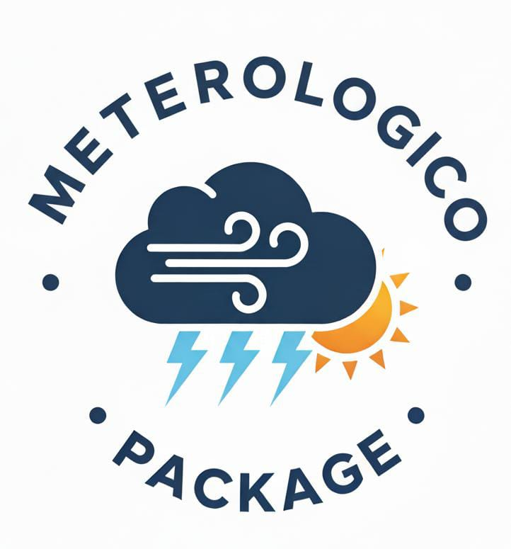

<!-- README.md is generated from README.Rmd. Please edit that file -->

# Meteorologico



<!-- badges: start -->

 [](https://lifecycle.r-lib.org/articles/stages.html#experimental)
[](https://github.com/emma11284/Meteorologico/actions/workflows/R-CMD-check.yaml)
[](https://app.codecov.io/gh/emma11284/Meteorologico)

<!-- badges: end -->

## Autores

#### Primer contribuyente

- Emma Schlieper – Autor principal
- **Usuario de GitHub:** [emma11284](https://github.com/emma11284)
- Correo: [schlieper.emma@gmail.com](schlieper.emma@gmail.com)

#### Segundo contribuyente

- David Bongiovanni – Autor principal
- **Usuario de GitHub:** [avicho48](https://github.com/avicho48)
- correo:
  [bongiovannidavidjuan@gmail.com](bongiovannidavidjuan@gmail.com)

## Instalación

Podes instalar la versión de desarrolo de Meteorologico desde
[GitHub](#0) con:

``` r
# install.packages("pak") 
pak::pak("emma11284/Meteorologico") 
```

## Funciones principales

### 1. `leer_estaciones()`

Esta función se encarga de **descargar y leer los datos de una o varias
estaciones meteorológicas**.  
Permite importar los registros de temperatura desde una fuente de datos,
preparándolos para ser analizados o visualizados.  
Constituye el primer paso del flujo de trabajo dentro del paquete.

**Ejemplo:**

``` r
leer_estacion("NH0437", "datos/NH0437.csv")
```

### 2. `tabla_resumen_temp()`

La función `resumen_temp()` produce una **tabla de resumen estadístico**
de la variable `temperatura_abrigo_150cm` para una o más estaciones.  
Incluye medidas como el promedio, el valor mínimo y el máximo
registrados, entre otras.  
Su finalidad es ofrecer una visión general y comparativa de los datos de
temperatura obtenidos, facilitando el análisis descriptivo.

**Ejemplo:**

``` r
df <- leer_estacion("NH0437", "datos/NH0437.csv")     tabla_resumen_temperatura(df)
```

### 3. `grafico_temp_mensual()`

Esta función **genera un gráfico de la temperatura mensual promedio** de
una estación determinada.  
A partir de los datos leídos con `leer_estacion()`, construye una
visualización que muestra la evolución de la temperatura a lo largo de
los meses.  
Es especialmente útil para observar patrones, variaciones o tendencias
en el comportamiento térmico de una estación específica.

**Ejemplo:**

``` r
grafico_temperatura_mensual(estaciones, colores = c("tomato", "dodgerblue"), titulo = "Temperatura mensual promedio")
```

## Cómo contribuir

¡Gracias por tu interés en contribuir a este paquete!  
Toda ayuda es bienvenida: ya sea corrigiendo errores, mejorando la
documentación o agregando nuevas funciones.

### Pasos para contribuir

1.  **Hacé un “fork” del repositorio**

    - En la parte superior derecha de esta página de GitHub hay un botón
      que dice **Fork**.  
    - Al hacer clic, se creará una copia del proyecto en tu propia
      cuenta de GitHub.

2.  **Hacé los cambios que quieras**

    - Podés editar los archivos directamente desde tu cuenta en GitHub o
      descargarlos a tu computadora.  
    - Agregá o mejorá el código, la documentación o los ejemplos.

3.  **Guardá y subí los cambios a tu copia del repositorio.**

4.  **Enviá una solicitud de cambio (“Pull Request”)**

    - Desde tu copia en GitHub, hacé clic en **Contribute → Open pull
      request**.  
    - Escribí una breve descripción de lo que cambiaste y enviá la
      solicitud.  
    - Revisaré tus cambios y, si todo está bien, los agregaré al paquete
      principal.

### Recomendaciones

- Asegurate de que tu contribución funcione correctamente antes de
  enviarla.  
- Mantené un lenguaje claro y un estilo de código simple.  
- Si encontrás un error o tenés una sugerencia, también podés abrir un
  **Issue** en GitHub para comentarlo.

------------------------------------------------------------------------

¡Gracias por contribuir al desarrollo de este paquete! 🙌
